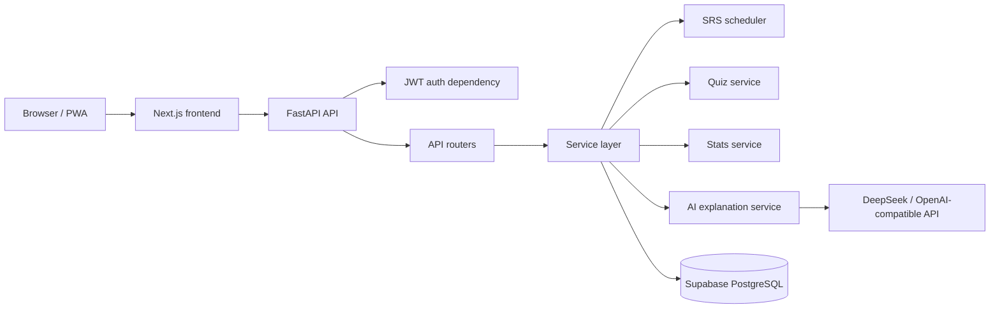

# Architecture

Zici is a full-stack Mandarin vocabulary learning app with a Next.js frontend and FastAPI backend.



## Frontend

The frontend is responsible for rendering the learning experience:

- login and registration
- grade and semester browsing
- flash-card review
- pinyin quiz
- statistics dashboard
- AI explanation panel

The frontend calls typed API helpers in `src/lib/api.ts`. It does not own review scheduling or user progress persistence.

## Backend

The backend is organized around FastAPI best practices:

- `backend/app/routers/`: HTTP routes and dependency wiring
- `backend/app/schemas/`: request and response contracts
- `backend/app/models/`: SQLModel database tables
- `backend/app/services/`: business logic
- `backend/app/core/`: settings, security, auth dependencies
- `backend/app/db/`: async database session setup

Route handlers stay thin. They validate input, resolve dependencies, call services, and return response models.

## Data Flow

1. A student logs in and receives a JWT bearer token.
2. Protected frontend requests include `Authorization: Bearer <token>`.
3. FastAPI resolves the current user with `Depends(get_current_user)`.
4. User-scoped queries filter by `current_user.id`.
5. Review answers are passed to the SRS service.
6. The SRS service calculates the next review interval and status.
7. Progress and review events are committed to PostgreSQL.

## Migration Relevance

The repo includes a minimal `backend/legacy_flask/` reference showing Flask blueprints for the same core concepts. The FastAPI implementation demonstrates the migration pattern:

| Concern | Flask reference | FastAPI implementation |
|---|---|---|
| Route grouping | `Blueprint` | `APIRouter` |
| Request parsing | `request.args`, `request.get_json()` | typed parameters and schemas |
| Response shape | `jsonify()` | `response_model` |
| Auth | none in reference | JWT dependency |
| Persistence | in-memory reference | async SQLModel and PostgreSQL |
| Docs | manual | OpenAPI at `/docs` |

## Testing Strategy

The backend test suite is designed to prove migration stability:

- SRS unit tests validate scheduling rules.
- Parity tests verify Python behavior matches the original TypeScript algorithm.
- API tests verify auth, user scoping, review flow, stats, quiz, and AI fallback behavior.
- AI tests mock provider responses instead of making live network calls.

Run:

```bash
cd backend
uv run pytest tests/ -v
```
